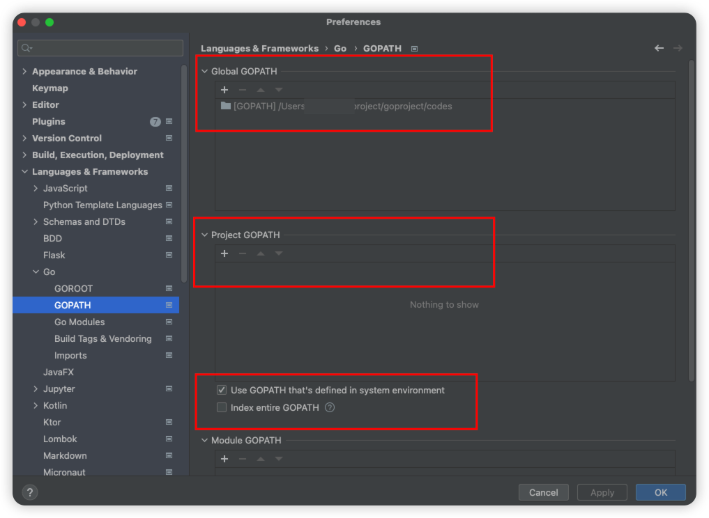

# GoBase
go学习记录

## idea 配置go环境

    idea 设置

## go mod

    idea 不使用go path, 改使用 go mod

### idea 设置

### 项目配置

    1. 进入项目: go_test
    2. 执行: 
        go mod init go_test
        go mod tidy
        会生成一个go.mod文件

    3. 包导入:
        import "go_test/目录名xxx/目录名xxx" 

## 函数传参

### 可变参数
#### 

    func main() {
        n := average(43, 56, 87, 12, 45, 57)
        fmt.Println(n)
    }
    
    func average(sf ...float64) float64 {
        fmt.Println(sf)
        fmt.Printf("%T \n", sf)
        var total float64
        for _, v := range sf {
            total += v
        }
        return total / float64(len(sf))
    }

#### map

    func main() {
        data := []float64{43, 56, 87, 12, 45, 57}
        n := average(data...)
        fmt.Println(n)
    }
    
    func average(sf ...float64) float64 {
        total := 0.0
        for _, v := range sf {
            total += v
        }
        return total / float64(len(sf))
    }

#### slice

    func main() {
        data := []float64{43, 56, 87, 12, 45, 57}
        n := average(data)
        fmt.Println(n)
    }
    
    func average(sf []float64) float64 {
        total := 0.0
        for _, v := range sf {
            total += v
        }
        return total / float64(len(sf))
    }

### struct
#### 

### interface

### go
### go
